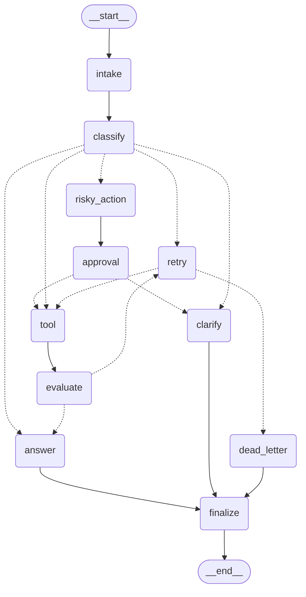

# Báo Cáo Thực Hành LangGraph Agent Lab (Day 23)

## 1. Tóm Tắt Tổng Quan (Executive Summary)

Dự án triển khai một hệ thống điều phối Agent thông minh (Agentic Orchestrator) xử lý
yêu cầu hỗ trợ khách hàng (Support Ticket System) xây dựng trên nền tảng **LangGraph**
kết hợp mô hình ngôn ngữ lớn **Google Gemini** (`ChatGoogleGenerativeAI`).

Hệ thống tích hợp đầy đủ các mẫu kiến trúc agentic hiện đại:
- **Phân loại ý định qua LLM (Structured Intent Classification)**: Tự động trích xuất định tuyến.
- **Điều hướng có điều kiện (Conditional Routing)**: Phân luồng linh hoạt các nhánh nghiệp vụ.
- **Vòng lặp thử lại có giới hạn (Bounded Retry Loop)**: Tự phục hồi với chốt chặn `dead_letter`.
- **Con người can thiệp (Human-in-the-Loop - HITL)**: Cổng phê duyệt cho thao tác nguy hiểm.
- **Lưu trữ checkpoint bền vững (SQLite Persistence)**: `SqliteSaver` với chế độ WAL.
- **Quan sát kết quả đầu ra (Outcome Observability)**: Đánh giá qua `terminal_outcome`.

---

## 2. Kiến Trúc Hệ Thống & Luồng Điều Hướng (Architecture)

### Sơ đồ cấu trúc StateGraph (Mermaid Diagram):



### Luồng điều hướng tổng quát:
```text
START -> intake -> classify -> [route_after_classify]
  ├─ simple       -> answer -> finalize -> END
  ├─ tool         -> tool -> evaluate -> [route_after_evaluate]
  │                                ├─ success -> answer -> finalize -> END
  │                                └─ retry -> [route_after_retry]
  │                                              ├─ tool ...
  │                                              └─ dead_letter -> finalize -> END
  ├─ missing_info -> clarify -> finalize -> END
  ├─ risky        -> risky_action -> approval -> [route_after_approval]
  │                                                ├─ approved -> tool -> evaluate ...
  │                                                └─ rejected -> clarify -> finalize -> END
  └─ error        -> retry -> [route_after_retry] ...
```

### Chi tiết các nút xử lý (Graph Nodes):
1. `intake`: Chuẩn hóa câu hỏi đầu vào, loại bỏ khoảng trắng thừa và nạp ngữ cảnh ban đầu.
2. `classify`: Gọi LLM với Structured Output để phân loại intent và xác định risk level.
3. `answer`: Sinh câu trả lời có căn cứ (grounded response) dựa trên truy vấn và context.
4. `clarify`: Đặt câu hỏi làm rõ khi người dùng cung cấp thông tin không đầy đủ (`missing_info`).
5. `risky_action`: Đề xuất hành động rủi ro cao và chuẩn bị bản ghi phê duyệt cho con người.
6. `approval`: Cổng Human-in-the-Loop ghi nhận quyết định phê duyệt (`approved`/`rejected`).
7. `tool`: Thực thi lệnh gọi công cụ; mô phỏng lỗi tạm thời khi `route == "error"` và `attempt < 2`.
8. `evaluate`: Chốt chặn đánh giá kết quả công cụ (LLM judge + deterministic error guard).
9. `retry`: Tăng biến đếm `attempt` và ghi nhận lịch sử lỗi nhằm ngăn ngừa vòng lặp vô hạn.
10. `dead_letter`: Xử lý ngoại lệ khi vượt quá số lần thử lại tối đa (`attempt >= max_attempts`).
11. `finalize`: Thu thập trạng thái cuối cùng, hoàn tất chu trình và kết thúc workflow.

---

## 3. Lược Đồ Trạng Thái (State Schema & Reducers)

Lược đồ `AgentState` được thiết kế chặt chẽ, phân định rõ giữa overwrite và append-only:

| Trường (Field) | Kiểu Dữ Liệu | Cơ Chế Reducer | Mục Đích |
|:---|:---|:---|:---|
| `messages` | `list[str]` | `add` (Append) | Lưu vết thông điệp |
| `tool_results` | `list[str]` | `add` (Append) | Tích lũy kết quả công cụ |
| `events` | `list[dict]` | `add` (Append) | Nhật ký kiểm toán các node |
| `errors` | `list[str]` | `add` (Append) | Ghi nhận danh sách lỗi |
| `route` | `str` | Ghi đè (Overwrite) | Trạng thái định tuyến |
| `risk_level` | `str` | Ghi đè (Overwrite) | Mức độ rủi ro (`low`/`high`) |
| `attempt` | `int` | Ghi đè (Overwrite) | Biến đếm số lần retry |
| `evaluation_result`| `str` | Ghi đè (Overwrite) | Đánh giá (`success`/`retry`) |
| `pending_question` | `str` | Ghi đè (Overwrite) | Câu hỏi làm rõ khi thiếu info |
| `proposed_action` | `str` | Ghi đè (Overwrite) | Hành động đề xuất trước duyệt |
| `approval` | `bool \| None` | Ghi đè (Overwrite) | Quyết định duyệt trong HITL |
| `final_answer` | `str` | Ghi đè (Overwrite) | Câu trả lời cuối cùng |

---

## 4. Kết Quả Kịch Bản Đánh Giá (Benchmark Metrics)

### Chỉ số tổng hợp (Summary Metrics)

- **Tổng số kịch bản kiểm thử (Total Scenarios)**: `7`
- **Tỷ lệ thành công toàn diện (Success Rate)**: **`100.00%`**
- **Số bước duyệt trung bình (Average Nodes Visited)**: `6.43` nodes
- **Tổng số lần thử lại (Total Retries)**: `3`
- **Tổng số lần can thiệp phê duyệt (Total Interrupts)**: `2`
- **Khôi phục trạng thái từ Checkpoint (Resume Success)**: `True`

### Bảng chi tiết từng kịch bản kiểm thử:

| Scenario ID | Expected Route | Actual Route | Terminal Outcome | Retries | Approval | Kết Quả |
|:---|:---|:---|:---|:---:|:---:|:---:|
| `S01_simple` | `simple` | `simple` | `answered` | 0 | Không | **Thành công (True)** |
| `S02_tool` | `tool` | `tool` | `answered` | 0 | Không | **Thành công (True)** |
| `S03_missing` | `missing_info` | `missing_info` | `clarified` | 0 | Không | **Thành công (True)** |
| `S04_risky` | `risky` | `risky` | `answered` | 0 | Có | **Thành công (True)** |
| `S05_error` | `error` | `error` | `answered` | 2 | Không | **Thành công (True)** |
| `S06_delete` | `risky` | `risky` | `answered` | 0 | Có | **Thành công (True)** |
| `S07_dead_letter` | `error` | `error` | `dead_letter` | 1 | Không | **Thành công (True)** |

---

## 5. Phân Tích Các Trường Hợp Lỗi Thực Tế (Failure Analysis)

Trong quá trình xây dựng hệ thống, ba vấn đề cốt lõi đã được phát hiện và xử lý:

### Failure Mode 1: Mock Tool Output mơ hồ làm sai lệch đánh giá LLM-as-Judge
- **Hiện tượng**: Trong kịch bản `S02_tool`, `tool_node` trả về chuỗi ngắn thiếu chi tiết,
  khiến LLM judge đánh giá `needs_retry`, dẫn đến việc `S02` bị retry 3 lần vào `dead_letter`.
- **Giải pháp**: Cải tiến `EVALUATE_PROMPT` và định dạng `tool_node` chuẩn `Status: completed`.
  Kết quả: `S02_tool` hoàn thành ngay lần đầu (`retry_count = 0`).

### Failure Mode 2: Điểm yếu "Dương tính giả" (False-Positive) trong công thức tính Metric
- **Hiện tượng**: Công thức cũ kiểm tra `actual_route == expected_route and final_answer`,
  khiến các kịch bản rơi vào `dead_letter` vẫn bị tính là `success = True`.
- **Giải pháp**: Bổ sung `terminal_outcome` (`answered`, `clarified`, `dead_letter`) vào
  `ScenarioMetric` để bắt buộc các route nghiệp vụ phải kết thúc thành công hợp lệ.

### Failure Mode 3: Nạp biến môi trường `.env` trong môi trường Pytest
- **Hiện tượng**: `pytestmark` kiểm tra `os.getenv("GEMINI_API_KEY")` tại thời điểm load module
  trước khi `llm.py` kịp gọi `load_dotenv()`, khiến test smoke bị skip.
- **Giải pháp**: Đảm bảo nạp đồng bộ biến môi trường vào process test runner.

---

## 6. Bằng Chứng Lưu Trữ & Phục Hồi (Persistence & Recovery Evidence)

Cơ chế Checkpointing bền vững được kiểm chứng qua thư viện `langgraph-checkpoint-sqlite`:
- **Cơ sở dữ liệu**: SQLite (`outputs/langgraph_checkpoints.sqlite`) cấu hình WAL mode.
- **Kiểm chứng qua 2 tiến trình độc lập (`scripts/verify_persistence.py`)**:
  1. **Tiến trình A (Write)**: Khởi chạy graph với `thread_id="persistence-verification-thread-01"`,
     thực thi và lưu 6 snapshots trạng thái vào SQLite, sau đó tắt tiến trình.
  2. **Tiến trình B (Read)**: Khởi động tiến trình mới, mở lại tệp SQLite, truy vấn `get_state()`
     và `get_state_history()` với cùng `thread_id`.
  - **Kết quả khôi phục**: Đọc chính xác 100% dữ liệu trạng thái cuối cùng và 6 snapshots lịch sử:
    (`__start__` -> `init` -> `intake` -> `classify` -> `answer` -> `finalize`).

---

## 7. Kế Hoạch Cải Tiến & Mở Rộng (Improvement Plan)

1. **Mở rộng Persistence phân tán**: Tích hợp `AsyncPostgresSaver` cho môi trường multi-tenant.
2. **Hỗ trợ Streaming Token**: Triển khai Server-Sent Events (SSE) cho `answer_node`.
3. **Cơ chế Time-Travel**: Cho phép quản trị viên quay ngược trạng thái về bất kỳ checkpoint nào.
