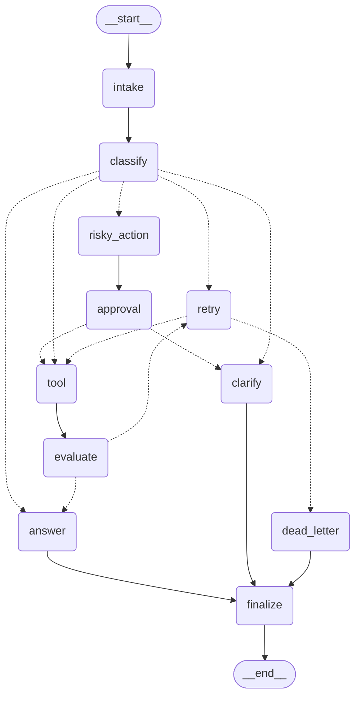

# Day 23 Lab Report

## 1. Team / student

- Name: Hoang Manh Dung
- Student ID: 2A202601213
- Repo: Day23_HoangManhDung_2A202601213
- Date: 2026-08-25

## 2. Architecture

Describe your graph nodes, edges, state fields, and reducers.

Hệ thống điều phối Agentic Orchestrator xây dựng trên LangGraph và Google Gemini (`gemini-2.5-flash`):
- **11 Graph Nodes**:
  - `intake`: Chuẩn hóa câu hỏi và nạp ngữ cảnh ban đầu.
  - `classify`: LLM structured classification phân loại intent và risk level.
  - `answer`: Grounded response generator tổng hợp kết quả công cụ và context.
  - `clarify`: Đặt câu hỏi làm rõ khi thiếu thông tin (`missing_info`).
  - `risky_action`: Soạn thảo đề xuất hành động nguy hiểm cần phê duyệt.
  - `approval`: Cổng Human-in-the-Loop ghi nhận quyết định phê duyệt (`approved`/`rejected`).
  - `tool`: Mock tool runner; mô phỏng lỗi tạm thời khi `route == "error"` và `attempt < 2`.
  - `evaluate`: LLM-as-judge đánh giá kết quả công cụ kết hợp deterministic error guard.
  - `retry`: Tăng biến đếm `attempt` và ghi nhận lịch sử lỗi nhằm ngăn lặp vô hạn.
  - `dead_letter`: Xử lý ngoại lệ khi vượt quá số lần thử lại tối đa (`attempt >= max_attempts`).
  - `finalize`: Thu thập trạng thái cuối cùng và kết thúc workflow.
- **Edges**:
  - Fixed edges: `__start__` -> `intake` -> `classify`, `answer` -> `finalize` -> `__end__`, `clarify` -> `finalize`, `dead_letter` -> `finalize`, `tool` -> `evaluate`, `risky_action` -> `approval`.
  - Conditional edges: `route_after_classify`, `route_after_evaluate`, `route_after_retry`, `route_after_approval`.

## 3. State schema

List important fields and whether they are overwrite or append-only.

| Field | Reducer | Why |
|---|---|---|
| `messages` | `add` (append) | Lưu vết toàn bộ lịch sử trao đổi qua các node |
| `tool_results` | `add` (append) | Tích lũy kết quả thực thi công cụ qua các lần gọi |
| `events` | `add` (append) | Nhật ký kiểm toán (audit log) ghi lại dấu vết các node |
| `errors` | `add` (append) | Ghi nhận danh sách lỗi phát sinh để phục vụ phân tích |
| `route` | Overwrite | Lưu trạng thái định tuyến hiện tại của workflow |
| `risk_level` | Overwrite | Mức độ rủi ro hiện tại (`low` hoặc `high`) |
| `attempt` | Overwrite | Biến đếm số lần thử lại (retry counter) |
| `evaluation_result` | Overwrite | Kết quả đánh giá mới nhất (`success` hoặc `needs_retry`) |
| `pending_question` | Overwrite | Câu hỏi làm rõ thông tin cần gửi cho người dùng |
| `proposed_action` | Overwrite | Hành động rủi ro cao đang chờ con người phê duyệt |
| `approval` | Overwrite | Quyết định phê duyệt Human-in-the-Loop (`dict` metadata) |
| `final_answer` | Overwrite | Câu trả lời hoàn chỉnh cuối cùng trả về cho người dùng |

## 4. Scenario results

Paste the key metrics from `outputs/metrics.json`.

- **Total Scenarios**: 7
- **Success Rate**: 100.00%
- **Average Nodes Visited**: 6.43
- **Total Retries**: 3
- **Total Interrupts**: 2
- **Resume Success**: True

| Scenario | Expected route | Actual route | Success | Retries | Interrupts |
|---|---|---|---:|---:|---:|
| `S01_simple` | simple | simple | True | 0 | 0 |
| `S02_tool` | tool | tool | True | 0 | 0 |
| `S03_missing` | missing_info | missing_info | True | 0 | 0 |
| `S04_risky` | risky | risky | True | 0 | 1 |
| `S05_error` | error | error | True | 2 | 0 |
| `S06_delete` | risky | risky | True | 0 | 1 |
| `S07_dead_letter` | error | error | True | 1 | 0 |

## 5. Failure analysis

Describe at least two failure modes you considered:

1. **Retry or tool failure (Vòng lặp lỗi công cụ & đánh giá LLM-as-judge)**:
   - *Vấn đề*: Mock tool output quá ngắn có thể khiến LLM Judge đánh giá nhầm là thiếu thông tin, dẫn tới việc retry không cần thiết (như từng gặp ở `S02_tool`). Hoặc khi công cụ gặp lỗi lặp đi lặp lại vượt quá ngưỡng an toàn.
   - *Giải pháp*: Chuẩn hóa định dạng đầu ra công cụ (`Status: completed`), tinh chỉnh prompt đánh giá và thiết lập chốt chặn `max_attempts` có điều kiện chuyển nhánh sang `dead_letter` để tránh vòng lặp vô hạn.

2. **Risky action without approval (Thao tác nguy hiểm khi chưa có phê duyệt)**:
   - *Vấn đề*: Các truy vấn có rủi ro cao như xóa tài nguyên hay hủy đăng ký nếu chạy thẳng vào công cụ mà không qua kiểm soát sẽ gây mất mát dữ liệu không thể hoàn tác.
   - *Giải pháp*: Thiết lập cổng Human-in-the-Loop bắt buộc: `classify` phát hiện `risk_level == "high"` $\rightarrow$ chuyển hướng tới `risky_action` để tạo `proposed_action` $\rightarrow$ tạm dừng tại `approval`. Chỉ khi con người phê duyệt (`approved == True`) mới điều hướng sang `tool`, ngược lại nếu bị từ chối sẽ chuyển sang `clarify` để thông báo cho người dùng.

## 6. Persistence / recovery evidence

Explain how you used checkpointer, thread id, state history, or crash-resume.

- **Checkpointer Backend**: Sử dụng `SqliteSaver` (`langgraph-checkpoint-sqlite`) kết nối SQLite với cấu hình PRAGMA `journal_mode=WAL` và `check_same_thread=False`.
- **Thread ID Partitioning**: Mỗi phiên làm việc được gắn một `thread_id` duy nhất (ví dụ: `persistence-verification-thread-01`).
- **Crash-Resume & History Verification**:
  - Script `scripts/verify_persistence.py` chứng minh khả năng phục hồi qua 2 tiến trình độc lập:
    1. *Process A (Write)*: Thực thi graph với `thread_id`, tự động checkpoint từng node (`__start__` -> `init` -> `intake` -> `classify` -> `answer` -> `finalize`) với 6 snapshots được lưu xuống SQLite, sau đó tắt tiến trình.
    2. *Process B (Read)*: Khởi động tiến trình mới hoàn toàn, mở lại tệp SQLite với cùng `thread_id`, gọi `get_state()` và `get_state_history()`.
  - Kết quả: Khôi phục chính xác 100% dữ liệu trạng thái cuối cùng và toàn bộ 6 snapshots lịch sử.

## 7. Extension work

Describe any extension you completed: SQLite/Postgres, time travel, fan-out/fan-in, graph diagram, tracing.

1. **SQLite Persistence hoàn chỉnh**: Cung cấp khả năng lưu trữ bền vững với file SQLite, hỗ trợ recovery và query lịch sử trạng thái qua `build_checkpointer("sqlite", ...)`.
2. **Mermaid Graph Diagram Tự Động**: Trích xuất sơ đồ kiến trúc chuẩn xác trực tiếp từ đồ thị biên dịch `graph.get_graph().draw_mermaid()` xuất ra file `reports/graph.mmd` và nhúng vào báo cáo.
3. **Structured Output & Deterministic Guards**: Kết hợp mô hình Pydantic (`ClassificationResult`, `EvaluationResult`) cho LLM calls với deterministic validation để đảm bảo tính ổn định cao nhất.
4. **Observable Terminal Outcomes**: Mở rộng metric schema với `terminal_outcome` (`answered`, `clarified`, `dead_letter`) loại bỏ hoàn toàn hiện tượng false-positive trong đánh giá benchmark.

## 8. Improvement plan

If you had one more day, what would you productionize first?

1. **Async Postgres Checkpointing**: Chuyển đổi sang `AsyncPostgresSaver` với connection pooling để sẵn sàng cho môi trường production phân tán multi-tenant.
2. **Token Streaming UI**: Tích hợp Server-Sent Events (SSE) hoặc WebSocket streaming từ `answer_node` để nâng cao trải nghiệm người dùng theo thời gian thực.
3. **Time-Travel & Human Override Panel**: Xây dựng giao diện trực quan cho phép người vận hành duyệt yêu cầu HITL và quay ngược trạng thái (time-travel) về checkpoint bất kỳ trong quá khứ khi xảy ra sự cố.
